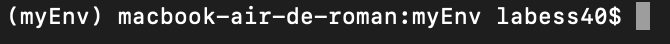

# Exe generation

Documentation for exe generation.

1. [Virtual environment creation](#virtual-environment-creation)
2. [Setup your virtual environment](#setup-your-virtual-environment)
    1. [Setup environment for a script](#setup-environment-for-a-script)
    2. [Setup environment for a library](#setup-environment-for-a-library)
        1. [With a requirements.txt file](#with-a-requirementstxt-file)
        2. [Without requirements.txt file](#without-requirementstxt-file)
3. [EXE file generation](#exe-file-generation)
    1. [EXE generation for a script](#exe-generation-for-a-script)
    2. [EXE generation for a library](#exe-generation-for-a-library)
4. [Add properties to your EXE file](#add-properties-to-your-exe-file)

## Virtual environment creation

First we need to create a virtual environment in order to reduce our exe file weight and his generation time.

We will add only necessaries libraries in this environment.
For that, we need to create a requirements.txt file listing all our dependencies.

Then :

* Go in your directory :

```BASH
python -m venv myEnv
```

Then you will have a new folder `myEnv` in your directory.

* Go to `myEnv/Scripts/` and copy `activate.bat` in your `C:\Workspace` directory.

* Finally :

```BASH
cd /Workspace
activate.bat
```

Now your virtual environment is running.



## Setup your virtual environment

Now we need to create our virtual environment with needed libraries.

### Setup environment for a script

Install all your dependencies :

```bash
pip install <name of your library>
```

> **⚠ WARNING: At least, you need to install pyinstaller :**

```bash
pip install pyinstaller
```

### Setup environment for a library

#### With a requirements.txt file

If you have a `requirements.txt` file with all your dependencies, go to your project directory and run :

```BASH
python -m pip install -r requirements.txt
```

> **⚠ WARNING: Don't forget to add pyinstaller in your requirements.txt file !!!**

#### Without requirements.txt file

Install all your dependencies :

```bash
pip install <name of your library>
```

> **⚠ WARNING: At least, you need to install pyinstaller :**

```bash
pip install pyinstaller
```

## EXE file generation

### EXE generation for a script

You just need to run :

```BASH
pyinstaller --onefile <path-to-my-file>
```

### EXE generation for a library

You just need to run :

```bash
pyinstaller <path-to-your-main-file> --paths <abslolute-path-to-your-library>
```

> **⚠ WARNING: If your library is at `/Workspace/dev/Library`, you need to specify `/Workspace/dev` for --paths parameter !**

## Add properties to your EXE file

If you want to add `Properties` to your executable file, you need to execute this command line :

```bash
pyinstaller --version-file=/Path/to/properties.rc <path-to-your-main-file> --paths <abslolute-path-to-your-library>
```

`properties.rc` is the file wich contains all details of your executable file.

> **You can find an example `properties.rc` file in this Gitlab repository !**

*File example :*

```rc
VSVersionInfo(
  ffi=FixedFileInfo(
    filevers=(3, 1, 0, 0),
    prodvers=(3, 1, 0, 0),
    mask=0x3f,
    flags=0x0,
    OS=0x40004,
    fileType=0x1,
    subtype=0x0,
    date=(0, 0)
    ),
  kids=[
    StringFileInfo(
      [
      StringTable(
        u'040904B0',
        [StringStruct(u'CompanyName', u'Nuxeo'),
        StringStruct(u'FileDescription', u'Desktop synchronization client for Nuxeo'),
        StringStruct(u'FileVersion', u'3.1.0'),
        StringStruct(u'InternalName', u'ndrive'),
        StringStruct(u'LegalCopyright', u'\xa9 Nuxeo. All rights reserved.'),
        StringStruct(u'OriginalFilename', u'ndrive.exe'),
        StringStruct(u'ProductName', u'Nuxeo Drive'),
        StringStruct(u'ProductVersion', u'3.1.0')])
      ]),
    VarFileInfo([VarStruct(u'Translation', [0, 0])])
  ]
)
```

*Ressource :* `https://www.tiger-222.fr/?d=2018/05/17/21/45/57-pyinstaller-windows-et-les-proprietes-de-lexecutable`
